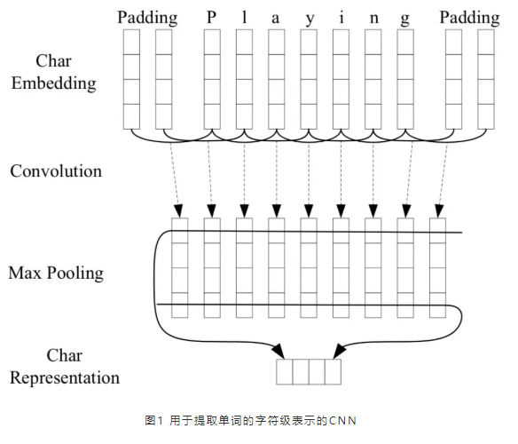
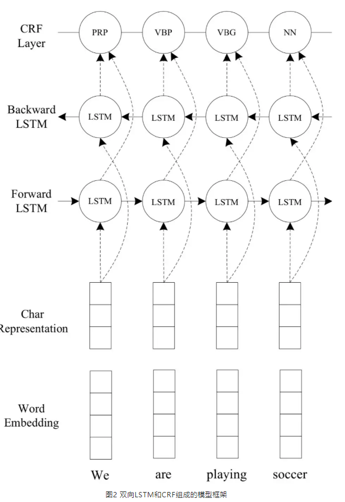
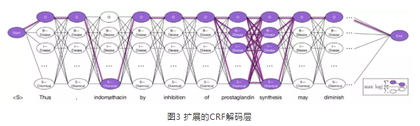
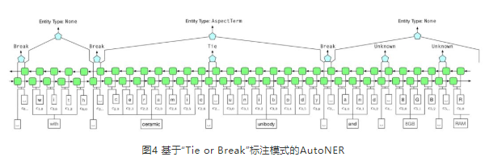
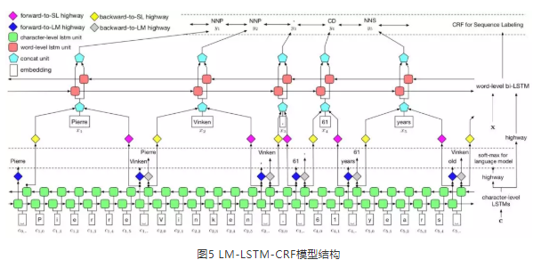
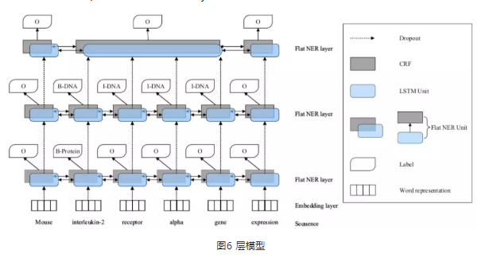
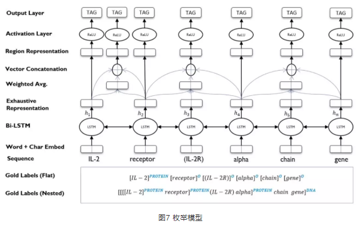
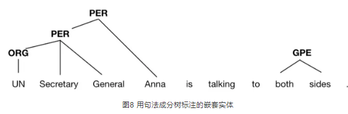
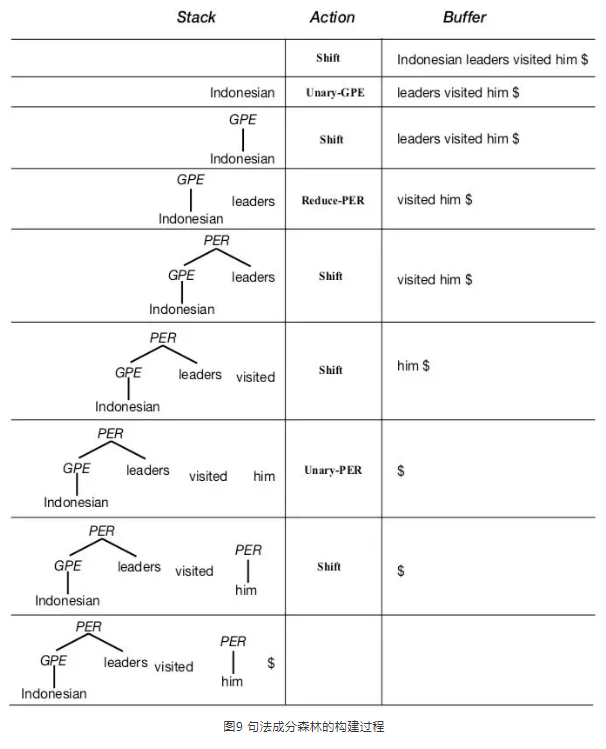

# 命名实体识别（Named Entity Recognition，NER） 介绍

## 一、什么是命名实体识别（Named Entity Recognition，NER）？

命名实体识别（Named Entity Recognition，NER）任务主要用于从自然语言文本中识别出具有特定意义的实体（eg：人名、地名、组织名等）。

在自然语言处理（Natural Language Processing, NLP）中，命名实体识别作为自然语言理解（Natural Language Understanding，NLU）的第一步，所以命名实体识别模型识别效果对于下游NLP任务（eg: 实体链接（Entity linking）、关系抽取（Relation extraction）和句法分析（Syntactic parsing）等）至关重要.

> eg: 对于 “南京市长江大桥于1968年12月29日建成通车”这句话，如果 命名实体识别模型 错误地识别出职务名——“南京市长”和人名——“江大桥”，这与正确答案 地名——“南京市”和桥名——“长江大桥” 相差甚远，则后续基于错误识别结果的NLP任务也无法得到期望的结果。

## 二、命名实体识别（Named Entity Recognition，NER）有哪些方法？

### 2.1 基于传统机器学习方法的命名实体识别（Named Entity Recognition，NER）方法

命名实体识别任务往往被看作语言序列标注（Linguistic sequence labeling）任务。传统的序列标注任务多使用线性模型，如隐马尔可夫模型（Hidden Markov Models, HMM）和条件随机场（Conditional Random Fields, CRF），并且依赖专家知识（Task-specific knowledge）和人工提取特征（Hand-crafted features）。

### 2.2 基于深度学习方法的命名实体识别（Named Entity Recognition，NER）方法

近年来随着机器算力的增长和深度学习算法的发展，命名实体识别任务利用分布式表示学习方法和非线性的神经网络构建了端到端的模型，从而在无专家知识和人工提取特征的基础上实现了更好的效果。

现阶段主流的命名实体识别的基本套路可以总结为“三板斧”：单词的字符级表示、（双向）LSTM编码和CRF解码。代表性工作是2016年发表在ACL的工作[1]。

首先，在对句子中的单词进行向量表示的时候，除了常用的词嵌入向量（word embedding），文章还利用CNN来学习每个单词字符级别的特征，如图1所示。


> 图1 用于提取单词的字符级表示的CNN

将单词“playing”的各字符嵌入向量作为CNN的输入，经过卷积和池化后，得到单词“playing”的字符级表示。通过这种方式，文章认为可以学习到单词的词法特征，如单词的前缀、后缀等特征。

接着，文章使用双向LSTM作为编码层，学习每个单词在句子中上下文的特征，如图2所示。


> 图2 双向LSTM和CRF组成的模型框架

将每个单词的词嵌入向量和字符级表示向量拼接之后作为编码层的输入，通过双向LSTM为每个单词得到两个（前向和后向）隐藏层向量表示，将这两个隐藏层向量拼接后作为解码层——CRF的输入。

最后，文章选用CRF作为解码层的原因是，CRF会考虑相邻label间的关系，而不是独立地将每个单词解码成label，例如，在词性标注任务中，“形容词”后更可能跟一个“名词”而不是“动词”，或者是在利用BIOES（Begin, Inside, Other, End & Single）标注模式的实体识别任务中，“I-ORG”不可能紧跟在“I-PER”后。从而能够为一个给定的文本序列解码出一个最好的label链。

## 三、命名实体识别（Named Entity Recognition，NER）有哪些数据集？

### 3.1 MSRA-NER实体数据集

- 介绍：由微软亚洲研究院标注的新闻领域的实体识别数据集，也是SIGNAN backoff 2006的实体识别任务的数据集之一。
- 时间：2016
- 实体类型：LOC(地名), ORG(机构名), PER(人名)
- 数据集：训练集46364个句子，验证集4365个句子
- 地址： https://github.com/GuocaiL/nlp_corpus/tree/main/open_ner_data/MSRA
- 数据格式

```s
    {"text": "当希望工程救助的百万儿童成长起来，科教兴国蔚然成风时，今天有收藏价值的书你没买，明日就叫你悔不当初！", "entity_list": []}
    {"text": "藏书本来就是所有传统收藏门类中的第一大户，只是我们结束温饱的时间太短而已。", "entity_list": []}
    {"text": "因有关日寇在京掠夺文物详情，藏界较为重视，也是我们收藏北京史料中的要件之一。", "entity_list": [{"entity_index": {"begin": 3, "end": 4}, "entity_type": "LOC", "entity": "日"}, {"entity_index": {"begin": 6, "end": 7}, "entity_type": "LOC", "entity": "京"}, {"entity_index": {"begin": 27, "end": 29}, "entity_type": "LOC", "entity": "北京"}]}
    ...
```

### 3.2 人民日报实体数据集

- 介绍：以1998年人民日报语料为对象，由北京大学计算语言学研究所和富士通研究开发中心有限公司共同制作的标注语料库。
- 实体类型：LOC(地名), ORG(机构名), PER(人名)
- 数据集：19359条数据集
- 地址： https://github.com/GuocaiL/nlp_corpus/tree/main/open_ner_data/people_daily
- 数据格式

```s
    {"text": "迈向充满希望的新世纪——一九九八年新年讲话(附图片1张)", "entity_list": [{"entity_index": {"begin": 12, "end": 19}, "entity_type": "DATE", "entity": "一九九八年新年"}]}
    {"text": "中共中央总书记、国家主席江泽民", "entity_list": [{"entity_index": {"begin": 0, "end": 4}, "entity_type": "ORG", "entity": "中共中央"}, {"entity_index": {"begin": 12, "end": 15}, "entity_type": "PERSON", "entity": "江泽民"}]}
    ...
```

### 3.3 新浪微博实体数据集

- 介绍：根据新浪微博2013年11月至2014年12月间历史数据筛选过滤生成，包含1890条微博消息，基于LDC2014的DEFT ERE的标注标准进行标注。
- 时间：2014
- 实体类型：地名、人名、机构名、行政区名，并且每个类别可细分为特指（NAM，如“张三”标签为“PER.NAM”）和泛指（NOM，如“男人”标签为“PER.NOM”）。
- 数据集：包括1890条微博消息，发布于2015年。包括1350条训练集、270条验证集、270条测试集。
- 地址：  https://github.com/GuocaiL/nlp_corpus/tree/main/open_ner_data/weibo
- 数据格式

```s
    {"text": "科技全方位资讯智能，快捷的汽车生活需要有三屏一云爱你", "entity_list": []}
    {"text": "对，输给一个女人，的成绩。失望", "entity_list": []}
    {"text": "今天下午起来看到外面的太阳。。。。我第一反应竟然是强烈的想回家泪想我们一起在嘉鱼个时候了。。。。有好多好多的话想对你说李巾凡想要瘦瘦瘦成李帆我是想切开云朵的心", "entity_list": [{"entity_index": {"begin": 38, "end": 39}, "entity_type": "LOC", "entity": "嘉"}, {"entity_index": {"begin": 59, "end": 62}, "entity_type": "PER", "entity": "李巾凡"}, {"entity_index": {"begin": 68, "end": 70}, "entity_type": "PER", "entity": "李帆"}]}
    ...
```

### 3.4 CLUENER细粒度实体数据集

- 介绍：根据清华大学开源的文本分类数据集THUCNEWS，进行筛选过滤、实体标注生成，原数据来源于Sina News RSS。
- 时间：2020
- 实体类型：组织(organization)、人名(name)、地址(address)、公司(company)、政府(government)、书籍(book)、游戏(game)、电影(movie)、职位(position)、景点(scene)等10个实体类别，且实体类别分布较为均衡。
- 数据集：训练集10748个句子，验证集1343个句子
- 地址：  https://github.com/GuocaiL/nlp_corpus/tree/main/open_ner_data/cluener_public
- 数据格式

```s
    {"text": "浙商银行企业信贷部叶老桂博士则从另一个角度对五道门槛进行了解读。叶老桂认为，对目前国内商业银行而言，", "entity_list": [{"entity_type": "name", "entity": "叶老桂", "entity_index": {"begin": 9, "end": 12}}, {"entity_type": "company", "entity": "浙商银行", "entity_index": {"begin": 0, "end": 4}}]}
    {"text": "生生不息CSOL生化狂潮让你填弹狂扫", "entity_list": [{"entity_type": "game", "entity": "CSOL", "entity_index": {"begin": 4, "end": 8}}]}
    ...
```

### 3.5 Yidu-S4K医疗命名实体识别数据集

- 介绍：源自CCKS2019评测任务一，即“面向中文电子病历的命名实体识别”的数据集。
- 时间：2019
- 实体类型：实验室检验、影像检查、手术、疾病和诊断、药物、解剖部位共6类实体类型。
- 数据集：1000条训练集、379条测试集
- 地址：  https://github.com/GuocaiL/nlp_corpus/tree/main/open_ner_data/yidu-s4k
- 数据格式

```s
    {"text": "，患者3月前因“直肠癌”于在我院于全麻上行直肠癌根治术（DIXON术），手术过程顺利，术后给予抗感染及营养支持治疗，患者恢复好，切口愈合良好。，术后病理示：直肠腺癌（中低度分化），浸润溃疡型，面积3.5*2CM，侵达外膜。双端切线另送“近端”、“远端”及环周底部切除面未查见癌。肠壁一站（10个）、中间组（8个）淋巴结未查见癌。，免疫组化染色示：ERCC1弥漫（+）、TS少部分弱（+）、SYN（-）、CGA（-）。术后查无化疗禁忌后给予3周期化疗，，方案为：奥沙利铂150MG D1，亚叶酸钙0.3G+替加氟1.0G D2-D6，同时给与升白细胞、护肝、止吐、免疫增强治疗，患者副反应轻。院外期间患者一般情况好，无恶心，无腹痛腹胀胀不适，无现患者为行复查及化疗再次来院就诊，门诊以“直肠癌术后”收入院。   近期患者精神可，饮食可，大便正常，小便正常，近期体重无明显变化。", "entity_list": [{"entity_index": {"begin": 8, "end": 11}, "entity_type": "疾病和诊断", "entity": "直肠癌"}, {"entity_index": {"begin": 21, "end": 35}, "entity_type": "手术", "entity": "直肠癌根治术（DIXON术）"}, {"entity_index": {"begin": 78, "end": 95}, "entity_type": "疾病和诊断", "entity": "直肠腺癌（中低度分化），浸润溃疡型"}, {"entity_index": {"begin": 139, "end": 159}, "entity_type": "解剖部位", "entity": "肠壁一站（10个）、中间组（8个）淋巴结"}, {"entity_index": {"begin": 230, "end": 234}, "entity_type": "药物", "entity": "奥沙利铂"}, {"entity_index": {"begin": 243, "end": 247}, "entity_type": "药物", "entity": "亚叶酸钙"}, {"entity_index": {"begin": 252, "end": 255}, "entity_type": "药物", "entity": "替加氟"}, {"entity_index": {"begin": 276, "end": 277}, "entity_type": "解剖部位", "entity": "肝"}, {"entity_index": {"begin": 312, "end": 313}, "entity_type": "解剖部位", "entity": "腹"}, {"entity_index": {"begin": 314, "end": 315}, "entity_type": "解剖部位", "entity": "腹"}, {"entity_index": {"begin": 342, "end": 347}, "entity_type": "疾病和诊断", "entity": "直肠癌术后"}]}
    ...
```

### 3.6 面向试验鉴定的实体数据集

- 介绍：面向试验鉴定的命名实体数据集是由军事科学院系统工程研究院在CCKS 2020中组织的一个评测。
- 时间：2020
- 实体类型：试验要素(如：RS-24弹道导弹、SPY-1D相控阵雷达)、性能指标(如测量精度、圆概率偏差、失效距离)、系统组成(如中波红外导引头、助推器、整流罩)、任务场景(如法国海军、导弹预警、恐怖袭击)四大类。
- 数据集：400篇的标注文档
- 地址：   https://www.biendata.xyz/competition/ccks_2020_8/
- 数据格式

> 输入：
```s
美国洛马公司在新墨西哥州白沙导弹靶场，完成“微型碰撞杀伤”拦截弹重新设计后的第二次飞行试验，进一步检验了拦截弹的敏捷性和气动性能，标志着其成熟度进一步提升。“微型碰撞杀伤”拦截弹采取直接碰撞杀伤技术，主要用于提高美国陆军应对火箭弹威胁的能力。
```

> 输出：
```s
{
"begin_pos":21,"end_pos":31,"试验要素"
"begin_pos":56,"end_pos":58,"性能指标"
"begin_pos":60,"end_pos":63,"性能指标"
"begin_pos":91,"end_pos":98,"系统组成"
"begin_pos":106,"end_pos":109,"任务场景"
"begin_pos":112, "end_pos":116,"任务场景"
}
```

### 3.7 BosonNLP实体数据集

- 介绍：玻森数据提供的命名实体识别数据，采用UTF-8进行编码
- 时间：2020
- 实体类型：时间、地点、人名、组织名、公司名、产品名
- 数据集：2000段落
- 地址：   https://github.com/GuocaiL/nlp_corpus/tree/main/open_ner_data/boson
- 数据格式

```s
    {"text": "高勇：男，中国国籍，无境外居留权，", "entity_list": [{"entity_index": {"begin": 0, "end": 2}, "entity_type": "NAME", "entity": "高勇"}, {"entity_index": {"begin": 5, "end": 9}, "entity_type": "CONT", "entity": "中国国籍"}]}
    {"text": "1966年出生，汉族，中共党员，本科学历，工程师、美国项目管理协会注册会员（PMIMember）、注册项目管理专家（PMP）、项目经理。", "entity_list": [{"entity_index": {"begin": 8, "end": 10}, "entity_type": "RACE", "entity": "汉族"}, {"entity_index": {"begin": 11, "end": 15}, "entity_type": "TITLE", "entity": "中共党员"}, {"entity_index": {"begin": 16, "end": 20}, "entity_type": "EDU", "entity": "本科学历"}, {"entity_index": {"begin": 21, "end": 24}, "entity_type": "TITLE", "entity": "工程师"}, {"entity_index": {"begin": 25, "end": 33}, "entity_type": "ORG", "entity": "美国项目管理协会"}, {"entity_index": {"begin": 33, "end": 37}, "entity_type": "TITLE", "entity": "注册会员"}, {"entity_index": {"begin": 38, "end": 47}, "entity_type": "TITLE", "entity": "PMIMember"}, {"entity_index": {"begin": 49, "end": 57}, "entity_type": "TITLE", "entity": "注册项目管理专家"}, {"entity_index": {"begin": 58, "end": 61}, "entity_type": "TITLE", "entity": "PMP"}, {"entity_index": {"begin": 63, "end": 67}, "entity_type": "TITLE", "entity": "项目经理"}]}
    ...
```

### 3.8 影视音乐书籍实体数据集

- 介绍：影视音乐书籍实体数据集
- 时间：
- 实体类型：影视、音乐、书籍
- 数据集：大约10000条，具体包括7814条训练集、977条验证集以及978条测试集。
- 地址：   https://github.com/GuocaiL/nlp_corpus/tree/main/open_ner_data/video_music_book_datasets
- 数据格式

```s
    {"text": "我个人前一段看过求无欲的诡案组系列，剧情不错，主要是人物特点表现的很好，人物性格很大众化", "entity_list": [{"entity_index": {"begin": 12, "end": 15}, "entity_type": "boo", "entity": "诡案组"}]}
    {"text": "本人也比较喜欢看仙侠小说，推荐几个我个人爱看的：、绝世武魂、绝世武神、追鬼龙王之极品强少、万古武帝、", "entity_list": [{"entity_index": {"begin": 25, "end": 29}, "entity_type": "boo", "entity": "绝世武魂"}, {"entity_index": {"begin": 30, "end": 34}, "entity_type": "boo", "entity": "绝世武神"}, {"entity_index": {"begin": 35, "end": 44}, "entity_type": "boo", "entity": "追鬼龙王之极品强少"}, {"entity_index": {"begin": 45, "end": 49}, "entity_type": "boo", "entity": "万古武帝"}]}
    ...
```

### 3.9 中文电子病历实体数据集

- 介绍：目前现存公开的中文电子病历标注数据十分稀缺，为了推动CNER系统在中文临床文本上的表现， CCKS在2017、2018、2019、2020都组织了面向中文电子病历的命名实体识别评测任务。

#### 3.9.1 CCKS2017数据集

- 时间：2017
- 实体类型：症状和体征、检查和检验、疾病和诊断、治疗、身体部位


- 数据集：训练集包括300个医疗记录，测试集包含100个医疗记录
- 地址：   https://www.biendata.xyz/competition/CCKS2017_2/
- 数据格式

```s
  患者无明显胸闷，无胸痛，偶有头痛，无头晕，无心悸、气短，无恶心、呕吐，饮食可，睡眠及二便正常。查体：BP：140/90mmHg，口唇无发绀，双肺呼吸音清，未闻及干湿性啰音，心界不大，心率70次/分，律齐，各瓣膜未闻及病理性杂音，腹软，无压痛，无反跳痛及肌紧张，肝脾肋下未触及，肠鸣音正常。双下肢无水肿。神经系统查体：神清，言语不清，查体合作，额纹对称，双侧瞳孔正大等圆，对光反射灵敏。双侧鼻唇沟无变浅，伸舌居中，示齿口角不偏。右侧上肢肌力Ⅲ级，右侧下肢肌力Ⅲ级，肌张力减低，左侧上肢肌力Ⅴ级，左侧下肢肌Ⅴ级，肌张力正常，双侧肱二三头肌腱及跟膝腱反射正常存在，双侧巴氏征阴性。
  ...
```

#### 3.9.2 CCKS2018数据集

- 时间：2018
- 实体类型：解剖部位、症状描述、独立症状、药物、手术
- 数据集：训练集包括600个医疗记录，测试集包含400个医疗记录
- 地址：  https://www.biendata.xyz/competition/CCKS2018_1
- 百度云盘地址：[百度云盘](https://pan.baidu.com/share/init?surl=FfvhPd06iVX2CGS_VV3XOg) ( 提取码：ypqh )
- 数据格式

```s
1,
2,
...
64,
65,
66,乙状结肠 10  14  解剖部位;乙状结肠癌根治术   32  40  手术;乙状结肠 74  78  解剖部位;肠壁 138 140 解剖部位;淋巴结    149 152 解剖部位;淋巴结    160 163 解剖部位;奥沙利铂   264 268 药物;亚叶酸钙 277 281 药物;氟尿嘧啶 286 290 药物;肝    312 313 解剖部位;吐  315 316 独立症状;恶心 344 346 独立症状;腹  348 349 解剖部位;痛  349 350 症状描述;腹  350 351 解剖部位;胀  351 352 症状描述;不适 352 354 症状描述;乙状结肠   388 392 解剖部位;
67,直肠   9   11  解剖部位;直肠癌DIXON手术 17  27  手术;直肠   67  69  解剖部位;横结肠造口术 79  85  手术;直肠   128 130 解剖部位;神经 144 146 解剖部位;肠壁 193 195 解剖部位;淋巴结    263 266 解剖部位;奥沙利铂   392 396 药物;氟尿嘧啶 404 408 药物;亚叶酸钙 420 424 药物;肝    438 439 解剖部位;胃  441 442 解剖部位;吐  444 445 独立症状;发热 486 488 独立症状;畏寒 488 490 独立症状;恶心 492 494 独立症状;呕吐 494 496 独立症状;咳嗽 498 500 独立症状;胸  500 501 解剖部位;闷  501 502 症状描述;腹  504 505 解剖部位;胀  505 506 症状描述;腹  506 507 解剖部位;泻  507 508 症状描述;腹  510 511 解剖部位;痛  511 512 症状描述;直肠 555 557 解剖部位;
68,上腹   18  20  解剖部位;不适 20  22  症状描述;腹  25  26  解剖部位;痛  26  27  症状描述;嗳气 35  37  独立症状;反酸 39  41  独立症状;腹  42  43  解剖部位;胀  43  44  症状描述;恶心 45  47  独立症状;呕吐 48  50  独立症状;黑便 51  53  独立症状;胃  78  79  解剖部位;胃窦小弯侧  83  88  解剖部位;胃角 117 119 解剖部位;胃窦 121 123 解剖部位;胃  176 177 解剖部位;胃角 182 184 解剖部位;胃角 210 212 解剖部位;胃癌根治术  251 256 手术;胃    267 268 解剖部位;淋巴结    281 284 解剖部位;多西他赛   333 337 药物;S-1  338 341 药物;
...
```

#### 3.9.3 CCKS2019数据集

- 时间：2019
- 实体类型：疾病和诊断、检查、检验、手术、药物、解剖部位
- 数据集：训练集包括1000个医疗记录，测试集包含379个医疗记录
- 地址：  https://github.com/GuocaiL/nlp_corpus/tree/main/open_ner_data/2020_ccks_ner
- 数据格式

```s
    {"originalText": "，患者3月前因“直肠癌”于在我院于全麻上行直肠癌根治术（DIXON术），手术过程顺利，术后给予抗感染及营养支持治疗，患者恢复好，切口愈合良好。，术后病理示：直肠腺癌（中低度分化），浸润溃疡型，面积3.5*2CM，侵达外膜。双端切线另送“近端”、“远端”及环周底部切除面未查见癌。肠壁一站（10个）、中间组（8个）淋巴结未查见癌。，免疫组化染色示：ERCC1弥漫（+）、TS少部分弱（+）、SYN（-）、CGA（-）。术后查无化疗禁忌后给予3周期化疗，，方案为：奥沙利铂150MG D1，亚叶酸钙0.3G+替加氟1.0G D2-D6，同时给与升白细胞、护肝、止吐、免疫增强治疗，患者副反应轻。院外期间患者一般情况好，无恶心，无腹痛腹胀胀不适，无现患者为行复查及化疗再次来院就诊，门诊以“直肠癌术后”收入院。   近期患者精神可，饮食可，大便正常，小便正常，近期体重无明显变化。", "entities": [{"label_type": "疾病和诊断", "overlap": 0, "start_pos": 8, "end_pos": 11}, {"label_type": "手术", "overlap": 0, "start_pos": 21, "end_pos": 35}, {"label_type": "疾病和诊断", "overlap": 0, "start_pos": 78, "end_pos": 95}, {"label_type": "解剖部位", "overlap": 0, "start_pos": 139, "end_pos": 159}, {"end_pos": 234, "label_type": "药物", "overlap": 0, "start_pos": 230}, {"end_pos": 247, "label_type": "药物", "overlap": 0, "start_pos": 243}, {"end_pos": 255, "label_type": "药物", "overlap": 0, "start_pos": 252}, {"label_type": "解剖部位", "overlap": 0, "start_pos": 276, "end_pos": 277}, {"label_type": "解剖部位", "overlap": 0, "start_pos": 312, "end_pos": 313}, {"label_type": "解剖部位", "overlap": 0, "start_pos": 314, "end_pos": 315}, {"label_type": "疾病和诊断", "overlap": 0, "start_pos": 342, "end_pos": 347}]}
    ...
```

#### 3.9.4 CCKS2020数据集

- 时间：2020
- 实体类型：疾病和诊断、检查、检验、手术、药物、解剖部位
- 数据集：训练集包括1050个医疗记录
- 地址：  https://www.biendata.xyz/competition/ccks_2020_2_1/
- 数据格式

```s
    对儿童SARST细胞亚群的研究表明，与成人SARS相比，儿童细胞下降不明显，证明上述推测成立。|||3    9    bod|||19    24    dis|||
    研究证实，细胞减少与肺内病变程度及肺内炎性病变吸收程度密切相关。|||10    10    bod|||10    13    sym|||17    17    bod|||17    22    sym|||
    ...
```

### 3.10 中文电子简历实体数据集

- 介绍：根据新浪财经网关于上市公司的高级经理人的简历摘要数据，进行筛选过滤和人工标注生成的，建于2018年。
- 时间：2018
- 实体类型：人名、国籍、籍贯、种族、专业、学位、机构、职称
- 数据集：3821条训练集、463条验证集、477条测试集
- 地址：   https://github.com/GuocaiL/nlp_corpus/tree/main/open_ner_data/ResumeNER
- 数据格式

```s
    {"text": "高勇：男，中国国籍，无境外居留权，", "entity_list": [{"entity_index": {"begin": 0, "end": 2}, "entity_type": "NAME", "entity": "高勇"}, {"entity_index": {"begin": 5, "end": 9}, "entity_type": "CONT", "entity": "中国国籍"}]}
    {"text": "1966年出生，汉族，中共党员，本科学历，工程师、美国项目管理协会注册会员（PMIMember）、注册项目管理专家（PMP）、项目经理。", "entity_list": [{"entity_index": {"begin": 8, "end": 10}, "entity_type": "RACE", "entity": "汉族"}, {"entity_index": {"begin": 11, "end": 15}, "entity_type": "TITLE", "entity": "中共党员"}, {"entity_index": {"begin": 16, "end": 20}, "entity_type": "EDU", "entity": "本科学历"}, {"entity_index": {"begin": 21, "end": 24}, "entity_type": "TITLE", "entity": "工程师"}, {"entity_index": {"begin": 25, "end": 33}, "entity_type": "ORG", "entity": "美国项目管理协会"}, {"entity_index": {"begin": 33, "end": 37}, "entity_type": "TITLE", "entity": "注册会员"}, {"entity_index": {"begin": 38, "end": 47}, "entity_type": "TITLE", "entity": "PMIMember"}, {"entity_index": {"begin": 49, "end": 57}, "entity_type": "TITLE", "entity": "注册项目管理专家"}, {"entity_index": {"begin": 58, "end": 61}, "entity_type": "TITLE", "entity": "PMP"}, {"entity_index": {"begin": 63, "end": 67}, "entity_type": "TITLE", "entity": "项目经理"}]}
    ...
```

### 3.11 CoNLL 2003数据集

- 介绍：1393篇英语新闻文章和909篇德语新闻文章
- 时间：2013
- 实体类型：LOC、ORG、PER、MISC
- 数据集：1393篇英语新闻文章和909篇德语新闻文章
- 地址：   https://www.clips.uantwerpen.be/conll2003/ner/
- 数据格式

```s
   U.N.         NNP  I-NP  I-ORG 
   official     NN   I-NP  O 
   Ekeus        NNP  I-NP  I-PER 
   heads        VBZ  I-VP  O 
   for          IN   I-PP  O 
   Baghdad      NNP  I-NP  I-LOC 
   .            .    O     O 
```

### 3.12 OntoNotes5.0 数据集

- 介绍：1745k英语、900k中文和300k阿拉伯语文本数据组成，来源于电话对话、新闻通讯社、广播新闻、广播对话和博客
- 时间：2013
- 实体类型：PERSON、ORGANIZATION和LOCATION等18个类别
- 数据集：1393篇英语新闻文章和909篇德语新闻文章
- 地址：    https://catalog.ldc.upenn.edu/ldc2013t19
- 数据格式

```s

```

### 3.13 CMeEE

- 介绍：数据集全称是Chinese Medical Entity Extraction，由“北京大学”、“郑州大学”、“鹏城实验室”和“哈尔滨工业大学（深圳）”联合提供，这是一个标准的NER识别任务
- 时间：2013
- 实体类型：疾病(dis)，临床表现(sym)，药物(dru)，医疗设备(equ)，医疗程序(pro)，身体(bod)，医学检验项目(ite)，微生物类(mic)，科室(dep)
- 数据集：
- 地址：    https://tianchi.aliyun.com/specials/promotion/2021chinesemedicalnlpleaderboardchallenge
- 数据格式

```s
[
  {
    "text": "（5）房室结消融和起搏器植入作为反复发作或难治性心房内折返性心动过速的替代疗法。",
    "entities": [
      {
        "start_idx": 3,
        "end_idx": 7,
        "type": "pro",
        "entity": "房室结消融"
      },
      {
        "start_idx": 9,
        "end_idx": 13,
        "type": "pro",
        "entity": "起搏器植入"
      },
      {
        "start_idx": 16,
        "end_idx": 33,
        "type": "dis",
        "entity": "反复发作或难治性心房内折返性心动过速"
      }
    ]
  },...
]
```

### 3.14 中药说明书实体识别数据集（“万创杯”中医药天池大数据竞赛）

- 介绍：疫情催化下，人工智能正在持续助力中医药传承创新加速发展，其中中医用药知识体系沉淀挖掘是一个基础工作。通过挖掘中药说明书构建中药合理用药的知识图谱，将为中医规范诊疗奠定较好基础。挑战旨在通过抽取中药药品说明书中的关键信息，中医药药品知识库的目标。
- 时间：2020-11-12
- 实体类型：
  - 药品(DRUG):中药名称，指在中医理论指导下，用于预防、治疗、诊断疾病并具有康复与保健作用的物质。中药主要来源于天然药及其加工品，包括植物药、动物药、矿物药及部分化学、生物制品类药物。例子: 六味地黄丸、逍遥散
  - 药物成分(DRUG_INGREDIENT): 中药组成成分，指中药复方中所含有的所有与该复方临床应用目的密切相关的药理活性成分。例子:当归、人参、枸杞
  - 疾病(DISEASE): 疾病名称，指人体在一定原因的损害性作用下，因自稳调节紊乱而发生的异常生命活动过程，是特定的异常病理情形，而且会影响生物体的部分或是所有器官。通常解释为“身体病况”（medical condition），而且伴随着特定的症状及医学征象。例子：高血压、心绞痛、糖尿病
  - 症状(SYMPTOM): 指疾病过程中机体内的一系列机能、代谢和形态结构异常变化所引起的病人主观上的异常感觉或某些客观病态改变。例子_：头晕、心悸、小腹胀痛_
  - 证候(SYNDROME): 中医学专用术语，概括为一系列有相互关联的症状总称，即通过望、闻、问、切四诊所获知的疾病过程中表现在整体层次上的机体反应状态及其运动、变化，简称证或者候，是指不同症状和体征的综合表现，单一的症状和体征无法表现一个完整的证候。 例子：血瘀、气滞、气血不足、气血两虚
  - 疾病分组(DISEASE_GROUP): 疾病涉及有人体组织部位的疾病名称的统称概念，非某项具体医学疾病。例子：肾病、肝病、肺病
  - 食物(FOOD):指能够满足机体正常生理和生化能量需求，并能延续正常寿命的物质。对人体而言，能够满足人的正常生活活动需求并利于寿命延长的物质称之为食物。例子：苹果、茶、木耳、萝卜
  - 食物分组(FOOD_GROUP): 中医中饮食养生中，将食物分为寒热温凉四性，同时中医药禁忌中对于具有某类共同属性食物的统称，记为食物分组。例子：油腻食物、辛辣食物、凉性食物
  - 人群(PERSON_GROUP): 中医药的适用及禁忌范围内相关特定人群。例子：孕妇、经期妇女、儿童、青春期少女
  - 药品分组(DRUG_GROUP): 具有某一类共同属性的药品类统称概念，非某项具体药品名。例子：止咳药、退烧药
  - 药物剂型(DRUG_DOSAGE): 药物在供给临床使用前，均必须制成适合于医疗和预防应用的形式，成为药物剂型。例子：浓缩丸、水蜜丸、糖衣片
  - 药物性味(DRUG_TASTE): 药品的性质和气味。例子：味甘、酸涩、气凉
  - 中药功效(DRUG_EFFICACY): 药品的主治功能和效果的统称，例子：滋阴补肾、去瘀生新、活血化瘀
- 数据集：
- 地址：    https://tianchi.aliyun.com/competition/entrance/531824/introduction
- 数据格式

```s
{"text": " 口服，一次6克，一日2-3次。  用于子宫寒冷，月经量少子宫寒冷，月经量少、后错，痛经  尚不明确。  1.忌食生冷食物。2.感冒时不宜服用。患有其他疾病者，应在医师指导下服用。3.平素月经正常，突然出现月经过少，或经期错后，或阴道不规则出血，或带下伴阴痒，或赤带者应去医院就诊。4.治疗痛经，宜在经前3～5天开始服药，连服1周。如有生育要求，应在医师指导下服用。5.服药后痛经不减轻，或重度痛经者，应到医院诊治。6.服药2周症状无缓解，应去医院就诊。7.对本品过敏者禁用，过敏体质者慎用。8.本品性状发生改变时禁止使用。9.请将本品放在儿童不能接触的地方。10.如正在使用其他药品，使用本品前请咨询医师或药师。  云南腾药制药股份有限公司  补气养血，调经止带。用于气血凝滞，子宫寒冷，月经量少、后错，痛经，白带量多，小腹下坠，不思饮食 6g*9袋  非处方药物（甲类）  如与其他药物同时使用可能会发生药物相互作用，详情请咨询医师或药师。 ", "entity_list": [{"entity_index": {"begin": 25, "end": 29}, "entity_type": "症状", "entity": "月经量少"}, {"entity_index": {"begin": 29, "end": 33}, "entity_type": "症状", "entity": "子宫寒冷"}, {"entity_index": {"begin": 42, "end": 44}, "entity_type": "症状", "entity": "痛经"}, {"entity_index": {"begin": 57, "end": 59}, "entity_type": "食物分组", "entity": "生冷"}, {"entity_index": {"begin": 103, "end": 107}, "entity_type": "症状", "entity": "月经过少"}, {"entity_index": {"begin": 109, "end": 113}, "entity_type": "症状", "entity": "经期错后"}, {"entity_index": {"begin": 115, "end": 122}, "entity_type": "症状", "entity": "阴道不规则出血"}, {"entity_index": {"begin": 124, "end": 129}, "entity_type": "症状", "entity": "带下伴阴痒"}, {"entity_index": {"begin": 131, "end": 133}, "entity_type": "症状", "entity": "赤带"}, {"entity_index": {"begin": 143, "end": 147}, "entity_type": "中药功效", "entity": "治疗痛经"}, {"entity_index": {"begin": 188, "end": 193}, "entity_type": "症状", "entity": "痛经不减轻"}, {"entity_index": {"begin": 195, "end": 199}, "entity_type": "症状", "entity": "重度痛经"}, {"entity_index": {"begin": 232, "end": 235}, "entity_type": "人群", "entity": "过敏者"}, {"entity_index": {"begin": 270, "end": 272}, "entity_type": "人群", "entity": "儿童"}, {"entity_index": {"begin": 323, "end": 327}, "entity_type": "中药功效", "entity": "补气养血"}, {"entity_index": {"begin": 328, "end": 332}, "entity_type": "中药功效", "entity": "调经止带"}, {"entity_index": {"begin": 335, "end": 339}, "entity_type": "症状", "entity": "气血凝滞"}, {"entity_index": {"begin": 340, "end": 344}, "entity_type": "症状", "entity": "子宫寒冷"}, {"entity_index": {"begin": 345, "end": 349}, "entity_type": "症状", "entity": "月经量少"}, {"entity_index": {"begin": 353, "end": 355}, "entity_type": "症状", "entity": "痛经"}, {"entity_index": {"begin": 356, "end": 360}, "entity_type": "症状", "entity": "白带量多"}, {"entity_index": {"begin": 361, "end": 365}, "entity_type": "症状", "entity": "小腹下坠"}]}
...
```

## 四、命名实体识别（Named Entity Recognition，NER）存在哪些问题？

随着深度学习的发展，命名实体识别（Named Entity Recognition，NER）也在一些问题上做了新的探索，包括解决标注数据规模和模型参数量不匹配的问题、文本中命名实体嵌套的问题、中文分词对实体识别的影响问题和模型的并行化问题等等。

### 4.1 标注数据不足

- 问题描述：随着模型规模和复杂度的愈发增加，需要训练的参数日益庞大，需要支持模型训练的人工标注数据的数量日益增加，也带了人工标注成本的增加问题。 
- 解决方法：
  - 方法一：远程监督的方法：
    - 介绍：该方法使用远程监督的方法来得到大量的远程监督标注数据
    - 存在问题：由于用于远程监督的知识库规模有限，大量的实体存在于文本中而未出现在知识库中，导致在远程监督时，将这些未出现在知识库中的实体标注为非实体，从而产生大量的假负例，这即是远程监督标注数据带来的有限覆盖问题（Limited Coverage）。
  - 方法二：优化模型
    - 介绍：通过优化模型，限制参数量，从而使得模型能够在较小的标注数据集上也能够完成训练。

#### 4.1.1 有限覆盖问题

- 动机：缓解有限覆盖问题对模型训练的影响
- 解决方法：Shang J等人在2018年的工作中提出了两种方式

1. 方法一：首先是利用最先进的短语挖掘方法在文本中挖掘出“高质量短语”，然后在利用知识库远程监督标注时，将文本中未出现在知识库中的“高质量短语”标注为“Unknow”。这样标注数据除了实体类别和非实体以外，还多了“Unknown”类别。随着标签的扩展，上一章中提到的基本套路中的CRF解码层就需要做相应改变，如图3所示。


> 图3 扩展的CRF解码层

基于BIOES序列标注模式进行实体标注，句子中每个单词的标签是“位置-实体类别”的形式，于是，每个单词有5*实体类别数量个可能的标签（图3中的每一列）。在传统的数据标注上，CRF解码层是从图中所有的路径中找出最大可能性的“一条”路径进行解码标注，即每列找出一个最可能的标签。而增加了“Unknow”类别后，文章认为“Unknown”类别即意味着其单词可能是任意的标签（图3中“prostaglandin”和“synthesis”对应的两列），则CRF解码层需要从图中所有路径中找出最大可能性的“一簇”路径进行解码标注。

2. 方法二：“Tie or Break”序列标注模式。不同于传统的标准的BIO2标注模式，“Tie or Break”不再直接对文本中的单词进行标注，而是对文本中相邻单词的关系进行标注。其规则如下：
   1. 相邻的两个单词出现在同一个（知识库）实体中，这两个单词间的关系标注为“Tie”；
   2. 相邻的两个单词中但凡有一个出现在Unknown类型的“高质量短语”中，这两个单词间的关系标注为“Unknown”；
   3. 其它情况，标注为“Break”。

这种标注模式有两点好处，其一，当文本中的短语在远程监督时被知识库中的实体部分匹配或者错误匹配时，这些短语内单词间的Tie关系是正确的不受影响的；其二，在远程监督标注时，文本中的单词极容易被知识库中unigram entity即由单独单词组成的实体错误地标注成假正例。而使用“Tie or Break”序列标注模式，无论一个单词时真正的unigram entity或者是假正例，它与两边的单词间的关系都是“Break”，由此减少了假正例对模型的影响。为了匹配这种新的标注模式，文章提出了一种新的命名实体识别模型——AutoNER，如图4所示。


> 图4 基于“Tie or Break”标注模式的AutoNER

自下而上，我们依然能看到单词的字符级别表示和双向LSTM编码，虽然与上一章提到的具体方法有所差异，但其思想基本是一致的，我们重点关注在LSTM编码层之后的解码层。在这个模型中，文章没有继续使用CRF而是分为两步去做解码：第一步，使用双向LSTM表示出单词间关系的隐藏层向量表示后，然后使用一个二分类器区分“Break”和“Tie”，不对“Unknown”做判断；第二步，将第一步预测出的两个相邻“Break”之间的短语视为一个待预测的候选实体，用单词的隐藏层向量综合表示该短语，然后输入到一个多分类器中。

#### 4.1.2 领域敏感特征

- 动机：得模型能在较小的标注数据集上完成训练
- 解决方法：2018年Liu L等人发表在AAAI上的工作[3]提出了一种LM-LSTM-CRF模型，通过模型的名称，我们就可以看出在该模型的编码层和解码层应当和第一章提到的主流方法相同，文章的主要贡献在单词的字符级表示，准确来讲，文章的主要贡献在对字符级别的特征的挑选。文章认为，单词字符级的特征虽然在已有的工作中被证明有效，但其是在大规模预料上经过预训练得到，包含了大量领域无关的特征，这些领域无关的特征需要更多的数据、更大的模型来训练更长的时间。而本文利用多任务学习提取共享特征的思路，以及语言模型（Neural Language Model）可以学习领域敏感特征的特性，使用语言模型从文本的大量特征中只提取领域相关的特征用于序列标注模型的训练，屏蔽掉了大量的任务无关特征，从而使得序列标注模型可以用少量的参数达到较好的效果，具体模型如图5所示。


> 图5 LM-LSTM-CRF模型结构

图中使用了双向LSTM提取字符级别的特征，而隐藏层向量却是用于两个任务：序列标注（主要任务）和语言模型（辅助任务）。其中，序列标注任务不再赘述，语言模型就是利用已知序列预测下一个单词是什么，在该模型中，利用单词的前一个隐藏层输出来表示该单词，如前向LSTM中用“Pierre”前一个字符的隐藏层向量来表示“Pierre”，然后进行Softmax分类操作。并且由于这两个任务是不相关的（相关的任务如实体识别和关系抽取），所以文章中在字符级别的LSTM后特意使用了highway层，将隐层向量映射到两个不同的向量空间，各自完成不同的任务。

### 4.2 命名实体嵌套

#### 4.2.1 介绍

- 动机：传统的命名实体识别任务关注的都是平坦实体（Flat entities），即文本中的实体之间不交叉、不嵌套。但现实中 句子中 实体 并非 不交叉、不嵌套。

> eg: 对于 “南京市长江大桥于1968年12月29日建成通车”这句话，桥名——“长江大桥” 中 包含 地名 地名——“长江”

- 命名实体嵌套：在一句文本中出现的实体，存在某个较短实体完全包含在另外一个较长实体内部的情况

#### 4.2.2 解决方法介绍

1. 方法一

- 方法一：Ju M等人于2018年发表在NAACL上的工作[4]，该工作提出一种层模型
- 思路：对文本一遍一遍的识别，直到识别不出实体为止。具体就是将前面提到的LSTM+CRF看作一个平坦命名实体识别层（flat NER layer），通过动态的堆叠flat NER layer，自内而外的一层一层的识别嵌套实体（先识别inner entities，再识别outer entities），直到flat NER layer识别不出实体，停止堆叠，模型如图6所示。


> 图6 层模型

自下而上，在第一个flat NER layer内，文章把每个token经过双向LSTM后对应的隐藏层表示输入到CRF中，用于识别最内层实体（most inner entities），然后将构成每个最内层实体的单词的隐藏层向量相加并平均来表示最内层实体，然后将其看作一个新的“单词”，替换组成最内层实体的所有单词，然后和其他被识别为Other的单词组成新的序列输入到下一个flat NER layer中，重复以上内容，直到某个flat NER layer将其输入的token都标记为Other后结束堆叠。作者认为通过这样的方式不但可以将嵌套的实体识别出来，还能考虑到inner entities和其outer entities之间的关系。

2. 方法二

第二篇是Sohrab M G等人于2018年发表在EMNLP上的工作[5]，该工作的主要内容集中在解码层，单词的字符级表示和双向LSTM编码层与前面的工作大同小异。如图7所示，在解码层，文章不再使用CRF，而是使用一个可变长的滑动窗口在编码层输出的隐藏层向量序列上滑动，枚举出所有可能的片段作为候选实体，然后利用隐藏层向量表示这些候选实体，最后分别通过Softmax进行分类。虽然试验结果不错，但我认为这种穷举的方法比较适合于序列长度较短的情况，因为一方面它忽略了标签间的相关性，另一方面当序列长度较长的情况下，穷举法会得到大量的负样本，使得正负样本不均衡，影响模型效果。


> 图7 枚举模型

3. 方法三

第三篇来自2018年EMNLP的工作[6]，不同于前面两篇工作对平坦命名实体识别主流方法的修修改改，本文的核心思想是将文本进行一定的转化之后，实现对嵌套实体的平坦访问（顺序访问）。

首先，如图8所示，作者将嵌套实体表示成一棵句法成分树，文本中的多个嵌套实体便被表示成一个森林。其中，树的叶子节点是文本中的token，而非叶子节点便是实体类别，这样实体的嵌套关系便被表示成了树中非叶子节点的父子关系。


> 图8 用句法成分树标注的嵌套实体

同时自底向上构建句法成分树的过程中，便实现了嵌套实体平坦访问，即构建树的过程中，用非叶子节点的构建动作对应了相应的实体类别，而这些动作是顺序的，不存在嵌套关系。而森林的构建过程是由多个树的顺序构建过程组成，其被放入一个栈中。如图9所示，


> 图9 句法成分森林的构建过程

构建动作的执行是由系统的当前状态决定的，系统的当前状态包含栈的状态，文本序列的剩余部分，构建动作的历史。这样，以系统状态作为输入，当前状态应执行的动作为输出，即可完成模型的训练。

具体而言，文章首先定义了三类动作：SHIFT，REDUCE-X和UNARY-X，其中X是指实体类别，属于一个预定义的类别集合。SHIFT操作是指将文本序列中的当前单词入栈；REDUCE-X是给栈顶的两个元素出栈，并给他们设置一个共同父节点X，然后将这个树元素入栈；UNARY-X则是将栈顶元素出栈，为其设置一个父节点X，然后将这个新的树元素入栈。定义好动作之后即得到了模型的输出（label），而其输入——系统的状态，则分三部分表示：

1. 栈的向量化表示使用了stack LSTM模型，在传统的LSTM上加入了栈顶指针，用栈顶指针所指向的unit的隐藏层输出来表示栈的状态；
2. 文本序列的剩余部分则通过一个后向的LSTM建模，使用顺序第一个单词的隐藏层输出表示文本序列的剩余部分的状态；
3. 历史构建动作则通过一个前向的LSTM进行学习，最近一次动作的隐藏层输出表示历史动作的状态。

将这三种状态的向量表示拼接起来表示系统状态，作为Softmax的输入。

## 参考文献

1. Ma X, Hovy E H. End-to-end Sequence Labeling via Bi-directional LSTM-CNNs-CRF[J]. meeting of the association for computational linguistics, 2016: 1064-1074.
2. Shang J, Liu L, Ren X, et al. Learning Named Entity Tagger using Domain-Specific Dictionary[J]. arXiv preprint arXiv:1809.03599, 2018.
3. Liu L, Shang J, Ren X, et al. Empower sequence labeling with task-aware neural language model[C]//Thirty-Second AAAI Conference on Artificial Intelligence. 2018.
4. Ju M, Miwa M, Ananiadou S. A neural layered model for nested named entity recognition[C]//Proceedings of the 2018 Conference of the North American Chapter of the Association for Computational Linguistics: Human Language Technologies, Volume 1 (Long Papers). 2018, 1: 1446-1459.
5. Sohrab M G, Miwa M. Deep Exhaustive Model for Nested Named Entity Recognition[C]//Proceedings of the 2018 Conference on Empirical Methods in Natural Language Processing. 2018: 2843-2849.
6. Wang B, Lu W, Wang Y, et al. A neural transition-based model for nested mention recognition[J]. arXiv preprint arXiv:1810.01808, 2018.
7. Zhang Y, Yang J. Chinese NER Using Lattice LSTM[J]. meeting of the association for computational linguistics, 2018: 1554-1564.
8. Strubell E, Verga P, Belanger D, et al. Fast and Accurate Entity Recognition with Iterated Dilated Convolutions[J]. empirical methods in natural language processing, 2017: 2670-2680.
