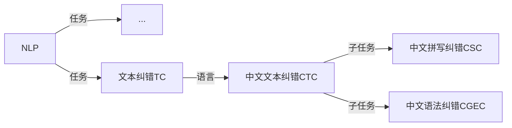

# 文本纠错
## 任务描述

>**文本纠错（Text Correction）** 是指对文本中存在的错误、不规范、不准确等问题进行修正和改进，以提高文本的质量和可读性。NLP（Natural Language Processing）领域的一项重要任务就是对文本进行纠错。下面我们来简单介绍一下它的具体定义和任务内容。
>
>具体定义：
>文本纠错主要针对自然语言文本中存在的错误、不规范、不准确等问题，进行修正和改进，以提高文本的质量和可读性。在实际应用中，文本纠错可以帮助提高信息传递的准确性和可靠性，减少信息传递中的误解和失真，提高人们的工作效率和生活质量。
>
>任务内容：
>文本纠错的任务内容主要包括以下几个方面：
>
>1. 错别字修正：对文本中出现的错别字、漏字、多字等进行修正，保证文本内容的规范和准确。
>
>2. 用词不当修正：对文本中出现的不符合语境、搭配不当、语义不明确等问题进行修正。
>
>3. 语法不规范修正：对文本中出现的语法错误、标点符号使用不当等问题进行修正。
>
>4. 逻辑错误修正：对文本中存在的逻辑错误、思维跳跃、概念混淆等问题进行修正。
>
>5. 信息缺失修正：对文本中存在的信息缺失、无关信息等进行修正，保证信息传递的完整性和有效性。
>
>6. 信息重复修正：对文本中存在的重复信息、冗余信息等进行修正，减少信息传递中的冗余和浪费。
>
>7. 主题不一致修正：对文本中存在的主题不一致、关系混乱等问题进行修正，保证信息传递的清晰性和条理性。
>
>8. 情感分析修正：对文本中存在的情感倾向、语气措辞等进行分析和修正，提高信息传递的情感价值。
>
>(以上内容由文心一言自动生成,prompt=[文本纠错是NLP重要的任务。请描述一下它的具体定义和任务内容。])

纠错任务与语言类别强相关，本教程重点讲述**中文文本纠错（Chinese Text Correction，CTC）**, 主要涉及的任务有：中文拼写纠错（Chinese Spelling Check, CSC）和中文语法纠错(Chinese Grammatical Error Correction, CGEC)

对应的NLP任务脉络如下：

## 教程
### 教程内容
### 教程设计
### 习题集

## 参考内容

### 评测指标

### 论文&项目

### 参考资源
* [1] Text Correction Papers [https://github.com/nghuyong/text-correction-papers](https://github.com/nghuyong/text-correction-papers)
* [2] 中文文本纠错数据集汇总 [https://tianchi.aliyun.com/dataset/138195](https://tianchi.aliyun.com/dataset/138195)
* [3] pycorrector [https://github.com/shibing624/pycorrector](https://github.com/shibing624/pycorrector)
