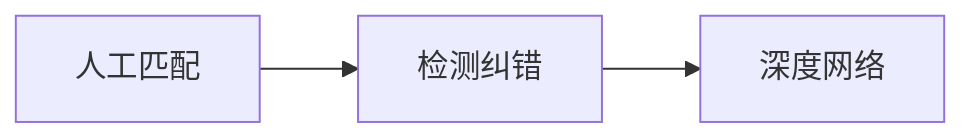

# 教程设计
## 介绍文本纠错的重要性和应用场景
给出应用场景
## 解释文本纠错的基本原理和方法
文本纠错发展历程介绍

## 介绍常见的文本错误类型和产生原因
输入方式上

语法上介绍
## 提供不同类型文本纠错的实例和练习
人工纠错挑战
数据集
## 介绍常用的文本纠错工具和软件
工具介绍

开源项目
## 解释文本纠错的评价指标和方法
准召算法，F1，F0.5
## 提供学生自主纠错的技巧和方法
提供Jupyter Note可以中colab上运行
## 介绍文本纠错在自然语言处理中的应用
与背景相同，试着阐述一下不同模型的应用场景
## 探讨文本纠错在人工智能领域的发展和前景
可以聊了大模型中纠错的应用
